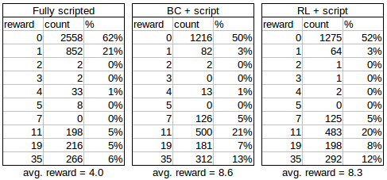

# MineRL2021-Intro-baselines
[MineRL 2021](https://minerl.io/) Intro track has three baseline agents:
1. Fully scripted
2. Behavioural cloning (BC) plus scripted
3. Reinforcement Learning (RL) plus scripted

The agents can be run in three different ways:
1. Colab notebook
2. Standalone file
3. Submittable repository (Under construction)

## Colab notebooks
This is the same code as in standalone files, but with extra documentation and fully running in Colab. The RL_plus_script is not included as it takes too long to run fully in Colab. The notebooks are:

[MineRL fully scripted on a fixed seed](https://colab.research.google.com/drive/1laXCpyf0k6O8Oo1AvUK4UrnywK7IcEh3?usp=sharing)

[MineRL fully scripted](https://colab.research.google.com/drive/1ipj34U_Ub8IsTO0I80o4bUTtltERMErm?usp=sharing)

[MineRL BC+scripted](https://colab.research.google.com/drive/1qfjHCQkukFcR9w1aPvGJyQxOa-Gv7Gt_?usp=sharing)

## Standalone files
These are used to run the agents on your local machine and are located in the [standalone](https://github.com/KarolisRam/MineRL2021-Intro-baselines/tree/main/standalone) directory.  
MineRL requires [JDK8](https://www.minerl.io/docs/tutorials/index.html) to be installed first.
After that, run:  
```
pip install -r requirements.txt
```
The agents can be run with:  
```
python fully_scripted_fixed_seed.py
```
```
python fully_scripted.py
```
```
python BC_plus_script.py
```
```
python RL_plus_script.py
```
The BC and RL ones come with pretrained models. If you want to train them yourself, you will have to uncomment the `train()` line at the end of the file.

## Submittable repositories  

The following links will lead you to submittable versions of the baselines:

[Fully scripted](https://github.com/minerllabs/minerl-diamond-2021-intro-scripted-submission-kit)

[Behavioural cloning plus script](https://github.com/minerllabs/minerl-diamond-2021-intro-bc-submission-kit)

[Reinforcement learning plus script](https://github.com/minerllabs/minerl-diamond-2021-intro-rl-submission-kit)


## Results
Baseline results over several thousands of episodes can be seen below:  



## Videos
Some videos of agents in action (best watched at 2x speed). Filmed using the [interactive mode](https://minerl.io/docs/tutorials/minerl_tools.html#interactive-mode-minerl-interactor).  

[MineRL agent trained to chop trees released in a village](https://www.youtube.com/watch?v=f3ggLEyTHRQ)  
[MineRL fully scripted agent, good seed](https://www.youtube.com/watch?v=xtPPwPmPmkU)  
[MineRL fully scripted agent, bad seed](https://www.youtube.com/watch?v=0-uTKbHklmY)  
[MineRL RL trained on Treechop + scripted agent](https://www.youtube.com/watch?v=dtH_Yn0yWLI)  


## Credits
Thank you to [Anssi Kanervisto](https://github.com/Miffyli) for developing the Behavioural cloning part of the baselines.
